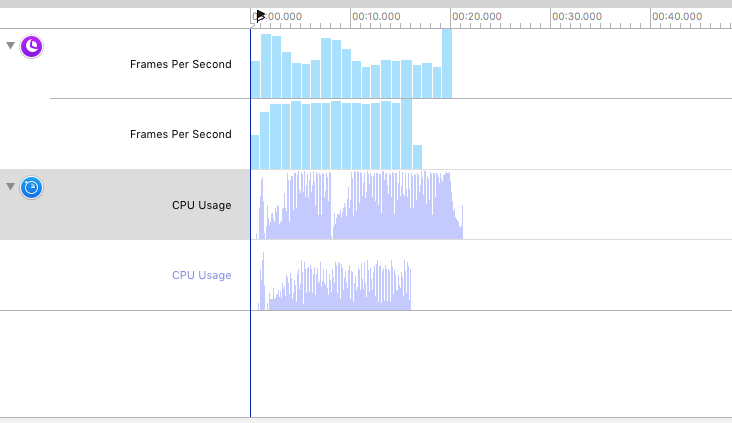
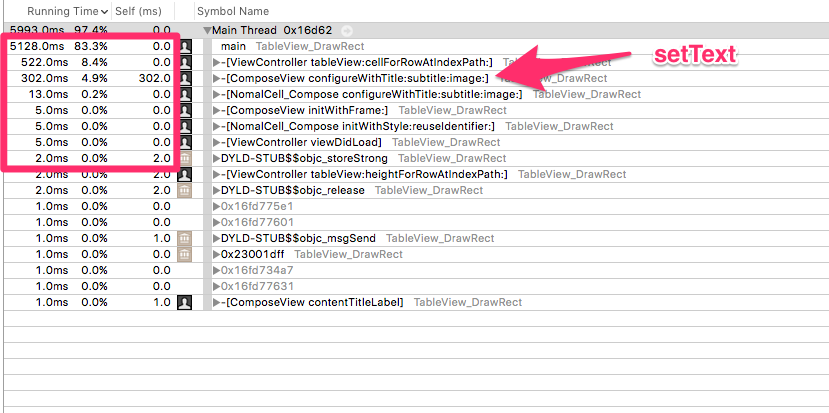
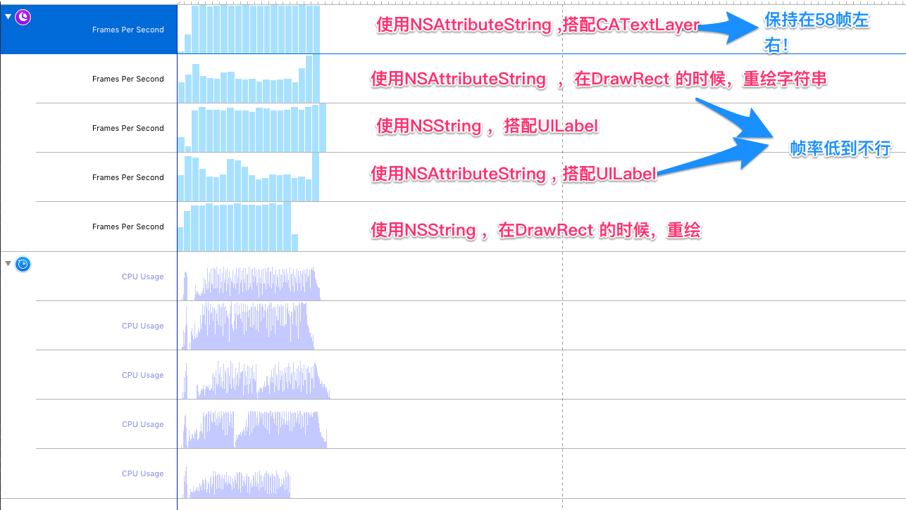
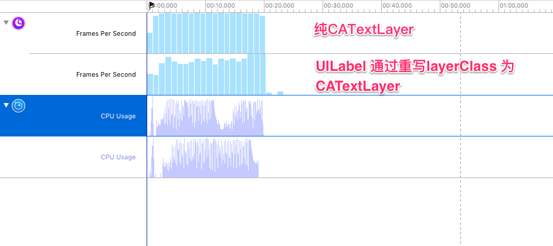
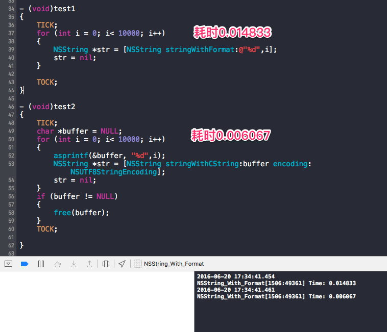

#UITableview Tip

##1）CPU消耗的时间低，不代表tableView 滚动的帧率就会高

NSAttributedString 对帧率的影响，一开始认为它对帧率的影响应该是很小的，但是经过测试发现->Holy shit, 原来它是这么屌的。

Demo 中的代码主要差别就是这几行代码。





使用NSAttributedString 来对label 的字体设值，帧率会下降到30帧左右。而通过label 的Text设值。帧率会保持在58左右。来看看CPU Usage，看看可以查出有什么函数特别耗时。


再来对比一下label  的setText 



从图片中可以看到setText 的耗时比Attribute Text的耗时更长，但是帧率却赢它几条街。

从CPU 利用率的曲线上看，可以发现问题。


CPU 总的利用率太高了。NSAttributeString  在CPU 上进行渲染了。把整个CPU 的利用率提上去了，因此影响了滚动的帧率。定位到问题了，那么解决办法是？

#->Google it

对于文字和图片的渲染，用得最多的就是UIImageView 和 UILabel ，替换的方案可以用CALayer 和CATextlayer.

好处：

> * 快到没朋友
> * 图片和文字的渲染可以在16ms 内完成。
> 

缺点：

> * 一些复杂的自定义的文字很难配置
> * 使用起来比较啰嗦，需要配置很多属性。
> 

QuartzCore 配合CoreText 可以满足大部分需求了，至少我的已经满足了。LOL,下面列出最常用到的几个类。

###QuartzCore
> * CALayer
> * CATextLayer
> * CAGradientLayer (设计最喜欢说，这里加个蒙板吧，要渐变的哦，ps, 你知道会影响效率吗，你用Instrument 的Core animation看看？).

###CoreText
> * NSAttributeString 
> * NSMutableAttributeString


有了他们，UI 的需求应该能满足了。说了这么久，来看一下他们的对比吧。👇



从图里面可以看到，UILabel 搭配 NSAttributeString ,在我的使用场景下，它们不应该在一起。勉强没幸福。CATextLayer 和NSAttributeString 更搭！在快速滚动下，帧率还可以保持在58 帧左右。实在是屌！

可以通过简单的改一下UILabel 的layer 的类（重写类方法 layerClass,UILabel 默认的layers是_UILabelLayer，它是CALayer的子类），以利用CATextLayer 的高性能绘制。

```
- (id)initWithFrame:(CGRect)frame
{
    if (self = [super initWithFrame:frame]) {
        [self setUp];
    }
    return self;
}

+ (Class)layerClass
{
    return [CATextLayer class];
}

- (CATextLayer *)textLayer
{
    return (CATextLayer *)self.layer;
}

- (void)setUp
{
    [self textLayer].alignmentMode = kCAAlignmentJustified;
    [self textLayer].wrapped = YES;
    [self.layer display];
}

- (void)setText:(NSString *)text
{
    super.text = text;
    [self textLayer].string = text;
}

- (void)setAttributedText:(NSAttributedString *)attributedText
{
    super.attributedText = attributedText;
    [self textLayer].string = attributedText;
}

- (void)setTextColor:(UIColor *)textColor
{
    super.textColor = textColor;
    [self textLayer].foregroundColor = textColor.CGColor;
}

- (void)setFont:(UIFont *)font
{
    super.font = font;
    CFStringRef fontName = (__bridge CFStringRef)font.fontName;
    CGFontRef fontRef = CGFontCreateWithFontName(fontName);
    [self textLayer].font = fontRef;
    [self textLayer].fontSize = font.pointSize;
    
    CGFontRelease(fontRef);
}
```

使用CATextLayer 的UILabel 和纯CATextLayer 的效率对比如下：


可以看到纯CATextLayer 的渲染是比CATextLayer 的UILabel快的。


##2)使用 Dispatch_once  为那些经常要创建的对象服务。

> * UIFont ,Screen scale , UIColor ,NSMutableParagraphStyle.etc .尽量使用dispatch_once 来初始化，然后保存起来重复使用。YYAsyncLayer  就是这么干的。
> 
> * 使用strptime 而不是 NSDateFomatter 。为什么！因为它快呀

```
//#include <time.h>

time_t t;
struct tm tm;
strptime([iso8601String cStringUsingEncoding:NSUTF8StringEncoding], "%Y-%m-%dT%H:%M:%S%z", &tm);
tm.tm_isdst = -1;
t = mktime(&tm);
[NSDate dateWithTimeIntervalSince1970:t + [[NSTimeZone localTimeZone] secondsFromGMT]];
```
> * 使用NSDictionary 里面的Key ，一般用［NSString stringWithFormat ...］。大多数情况下是没有效率的问题的，但是如果用在循环里面，那就会有效率的问题。使用test2 的方法，效率基本上是stringWithFormat 的3倍。
> 


